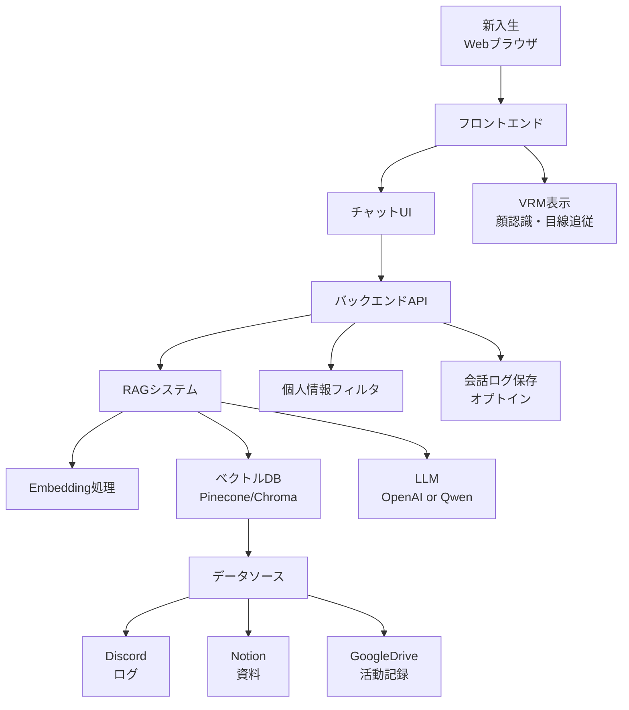
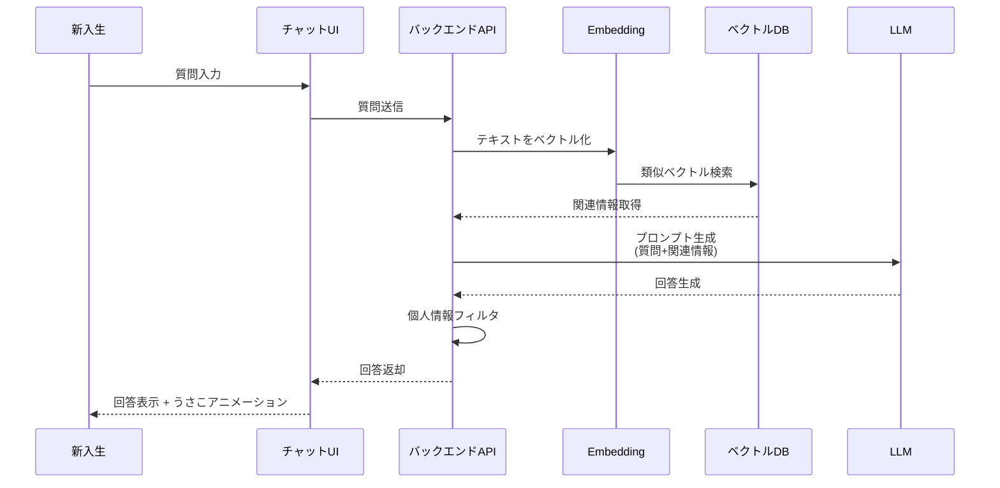
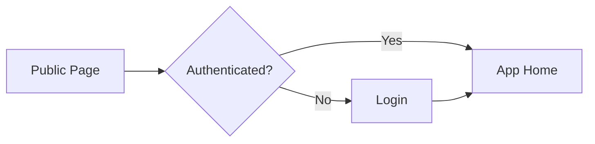
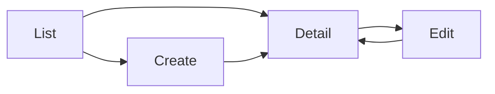
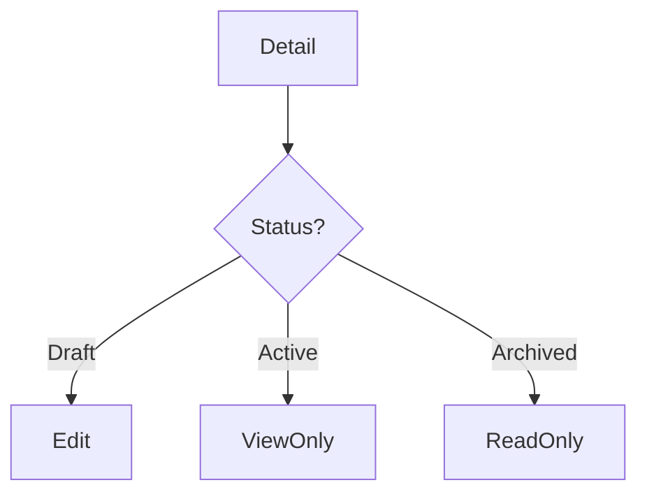
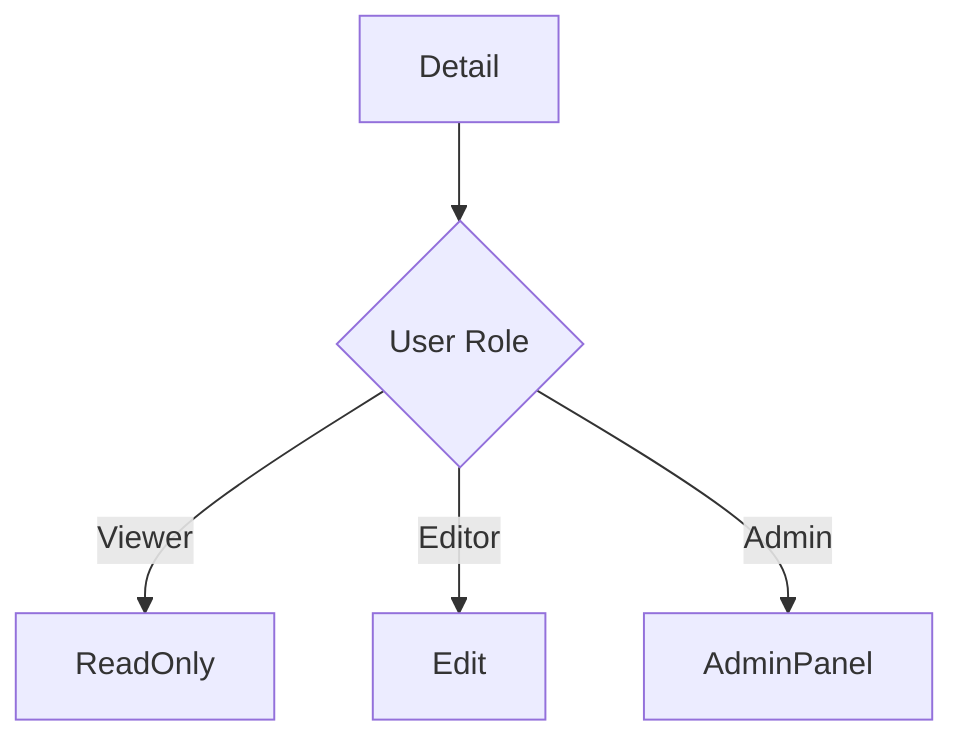
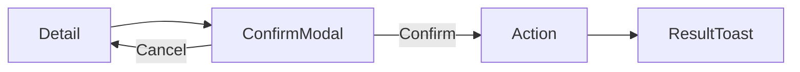
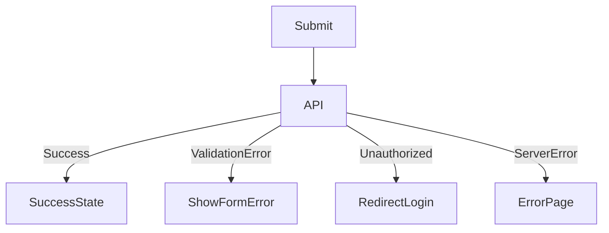
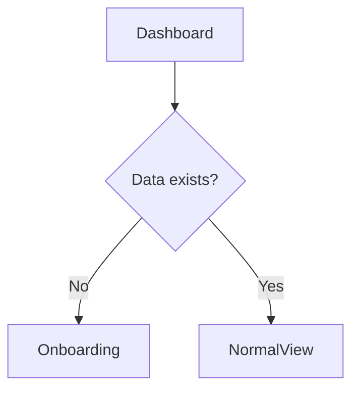

# 03_screen-flow

作成日時: 2026年3月1日 17:45
最終更新日時: 2026年3月1日 17:45
最終更新者: iseebi

# 🖥️ screen-flow.md テンプレート

---

# 0️⃣ 設計前提

| 項目 | 内容 |
| --- | --- |
| 対象ユーザー | **新入生（匿名）** / **部員（運用者）** |
| デバイス | Mobile / Desktop（Responsive） |
| 認証要否 | 新入生：不要（公開） / 管理：P1でDiscord OAuth |
| 権限制御 | P1：RBAC（部員ロール） |
| MVP範囲 | **P0：新入生チャット（オプトイン＋評価）**（管理画面はP1） |

---

# 1️⃣ 画面一覧（Screen Inventory）

| ID | 画面名 | 役割 | 認証 | 優先度 |
| --- | --- | --- | --- | --- |
| S-01 | ランディング | 入口 | 不要 | P0 |
| S-02 | ログイン | 認証 | 不要 | P0 |
| S-03 | ダッシュボード | 中核画面 | 必須 | P0 |
| S-04 | 一覧画面 | リソース一覧 | 必須 | P0 |
| S-05 | 詳細画面 | 個別閲覧 | 必須 | P0 |
| S-06 | 作成/編集画面 | データ変更 | 必須 | P0 |
| S-07 | 設定画面 | ユーザー設定 | 必須 | P1 |
| S-08 | 通知一覧 | 通知確認 | 必須 | P1 |
| S-09 | 管理画面 | 管理者専用 | 管理者 | P2 |

---

# 2️⃣ 全体遷移図（高レベル）

### 図1：システムアーキテクチャ図



### 図2：RAG処理フロー図



---

# 3️⃣ 認証フロー



---

# 4️⃣ CRUD標準遷移テンプレ



---

# 5️⃣ 状態別分岐（State-based Flow）



---

# 6️⃣ 権限別分岐（RBAC/ABAC）



---

# 7️⃣ モーダル・非同期操作



---

# 8️⃣ エラーフロー



---

# 9️⃣ 空状態 / 初回体験



---

# 🔟 モバイル考慮（任意）

| 項目 | Desktop | Mobile |
| --- | --- | --- |
| ナビゲーション | Sidebar | Bottom Nav |
| 詳細表示 | 2カラム | 1カラム |
| 編集 | ページ遷移 | フルスクリーン |

---

# 1⃣1⃣ URL設計テンプレ

```
/login
/dashboard
/entities
/entities/:id
/entities/:id/edit
/settings
/admin
```