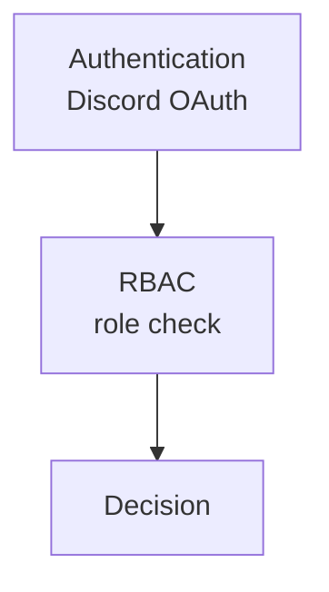

# 04_permission-design

作成日時: 2026年3月1日 17:43
最終更新日時: 2026年3月1日 17:43
最終更新者: iseebi

# 🔐 権限設計

---

# 0️⃣ 設計前提

| 項目 | 内容 |
| --- | --- |
| 権限モデル | **RBAC（P1で導入）** |
| マルチテナント | **なし（じょぎ専用）** |
| 認証方式 | **Discord OAuth（管理画面のみ）** |
| スコープ単位 | Global（単一組織） |
| MVP方針 | **P0は新入生側は公開**、管理はP1 |

---

# 1️⃣ 用語定義

| 用語 | 意味 |
| --- | --- |
| Subject | 操作主体（新入生 / 部員 / システム） |
| Resource | 操作対象（会話ログ、評価、取り込みジョブ、設定） |
| Action | 操作内容（read/create/update/delete/execute） |
| Role | 権限グループ |
| Policy | 条件付き許可ルール（例：部員ロール必須） |

---

# 2️⃣ 権限レイヤー構造



---

# 3️⃣ RBAC設計

## 3-1. グローバルロール

| ロール名 | レベル | 説明 |
| --- | --- | --- |
| ADMIN | 80 | 運用全般（会話閲覧/評価閲覧/取り込み状況/設定） |
| MEMBER | 50 | 基本閲覧（会話閲覧/評価閲覧） |
| GUEST | 10 | 管理画面アクセス不可（新入生はここ） |

---

> 方針：今回は「部員全員が管理を使う」ため、まずは **MEMBER/ADMINの2段階**で開始（P1）。
> 
> 
> ロールの付与条件は「Discordのじょぎサーバ内の部員ロール」を所持していること。
> 

## 3-2.  リソース別権限マトリクス（P1）

| Resource | Action | MEMBER | ADMIN | 備考 |
| --- | --- | --- | --- | --- |
| conversations | read | ✅ | ✅ | 会話ログ一覧/詳細 |
| feedbacks | read | ✅ | ✅ | 👍👎と理由 |
| kpi_metrics | read | ✅ | ✅ | 集計閲覧 |
| ingestion_runs | read | ✅ | ✅ | 取り込み状況 |
| ingestion_runs | execute | ❌ | ✅ | 取り込み実行（P1以降） |
| faq_entries | create/update/delete | ❌ | ✅ | FAQ編集（Notion連携/手動） |
| system_settings | read/update | ❌ | ✅ | レート制限等 |

---

## 3-3. RBAC判定ロジック（抽象）

```
if user.role.level >= required_level:
    allow
else:
    deny
```

---

# 4️⃣ ABAC設計テンプレ（必要になったら追加する条件）

P1以降に「部員でも一部だけ触れる範囲を制限したい」場合に導入。

例：
- `isExecutive == true` のときだけ `system_settings:update` を許可
- 個人情報リスクが高いログ（PII検知フラグ付き）は `ADMIN` のみ閲覧可

---

# 5️⃣ 認証（Discord OAuth）で取得する情報

| 項目 | 用途 |
| --- | --- |
| discord_user_id | users.id に保存（管理操作の主体） |
| username / avatar | UI表示（任意） |
| guild membership | じょぎサーバ所属チェック |
| role list | 部員ロール所持チェック（必須） |

---

# 6️⃣ 監査（Audit）

- 不正利用防止
- 誤操作の追跡
- レート制限調整の根拠
- 「誰が何を変えたか」の可視化

---

## 6-1. 監査対象アクション

| 区分 | 具体例 |
| --- | --- |
| 設定変更 | system_settings:update |
| RAG切替 | rag_toggle:update |
| 取り込み実行 | ingestion_runs:execute |
| FAQ編集 | faq_entries:create/update/delete |
| ログ閲覧 | conversations:read (大量取得時のみ) |

> ※ 新入生チャット操作は監査対象外（通常ログとは別）
> 

---

## 6-2. audit_logs テーブル（TiDB）

```
audit_logs (
  idVARCHAR(36)PRIMARYKEY,
  user_idVARCHAR(36),
actionVARCHAR(100),
  resource_typeVARCHAR(50),
  resource_idVARCHAR(36),
result ENUM('allow','deny'),
  ip_addressVARCHAR(45),
  created_at DATETIME,
  INDEX(user_id),
  INDEX(created_at)
)
```

---

## 🔒 監査ポリシー

- 保存期間：90日（P1）
- 管理画面から閲覧可能（ADMINのみ）
- エクスポート機能はP2

---

# 7️⃣ データモデル連携

- 個人情報は最小限
- 細かいメッセージは保存しない
- usageは保存する

---

## 🔹 users（管理者のみ）

```
users (
  idVARCHAR(36)PRIMARYKEY,
  discord_user_idVARCHAR(36),
role ENUM('ADMIN','MEMBER'),
  created_at DATETIME
)
```

---

## 🔹 sessions（新入生）

```
sessions (
  idVARCHAR(36)PRIMARYKEY,
  is_guestBOOLEANDEFAULTTRUE,
  consentedBOOLEANDEFAULTFALSE,
  created_at DATETIME
)
```

---

## 🔹 usage_logs（レート制御用）

```
usage_logs (
  idVARCHAR(36)PRIMARYKEY,
  session_idVARCHAR(36),
  tokensINT,
  categoryVARCHAR(50),
  created_at DATETIME,
  INDEX(session_id),
  INDEX(created_at)
)
```

> メッセージ本文は保存しない（方針明記）
> 

---

# 8️⃣ ログ設計

## 8-1. ABAC評価ログ

| フィールド | 内容 |
| --- | --- |
| user_id |  |
| action |  |
| resource_type |  |
| resource_id |  |
| matched_policy |  |
| result | allow/deny |
| timestamp |  |

---

## 8-2. 監査ログ

| フィールド | 内容 |
| --- | --- |
| who | user |
| what | action |
| where | resource |
| result | decision |
| ip | client_ip |

---

# 9️⃣ APIレイヤー統合

```tsx
function authorize(user, action, resource) {
  if (!isAuthenticated(user)) throw 401
  if (!tenantMatch(user, resource)) throw 403
  if (!rbacAllow(user, action)) throw 403
  if (!abacAllow(user, action, resource)) throw 403
}
```

---

# 🔟 フロントエンド制御

| パターン | 説明 |
| --- | --- |
| 非表示 | ボタンを出さない |
| 無効化 | disabled表示 |
| 警告 | warn表示 |

※ フロントはUX制御のみ。最終判定は必ずサーバー側。