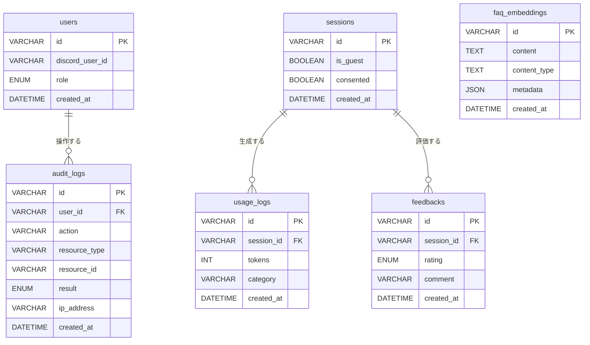

# 05_erd_md

作成日時: 2026年3月1日 17:30
最終更新日時: 2026年3月1日 17:48
最終更新者: iseebi

# 🗄️ DB設計書

---

# 0️⃣ 設計観点

| 項目 | 内容 |
| --- | --- |
| 権限モデル | RBAC（P1で導入） |
| ID戦略 | UUID（VARCHAR(36)） |
| 論理削除 | なし（シンプル運用） |
| 監査ログ | 必須（TiDB） |

---

# 1️⃣ DB分担

| DB | 用途 | テーブル |
| --- | --- | --- |
| Supabase (PostgreSQL) | Dify内部メタデータ管理 | Dify管理（触らない） |
| TiDB Serverless | アプリのログ・監査・RAGベクトル | users, sessions, usage_logs, feedbacks, audit_logs, faq_embeddings |

---

# 2️⃣ テーブル一覧

| ドメイン | テーブル名 | 役割 | DB | Phase |
| --- | --- | --- | --- | --- |
| 認証 | users | 管理者（部員）アカウント | TiDB | P1 |
| セッション | sessions | 新入生セッション管理 | TiDB | P0 |
| レート制御 | usage_logs | トークン消費ログ | TiDB | P0 |
| 評価 | feedbacks | 👍👎評価 | TiDB | P1 |
| 監査 | audit_logs | 管理操作の監査ログ | TiDB | P1 |
| RAG | faq_embeddings | FAQのベクトルデータ | TiDB | P1 |

---

# 3️⃣ ERD



---

# 4️⃣ カラム定義

## users（管理者のみ）

| カラム | 型 | 制約 | 説明 |
| --- | --- | --- | --- |
| id | VARCHAR(36) | PK | UUID |
| discord_user_id | VARCHAR(36) | NOT NULL UNIQUE | Discord UID |
| role | ENUM | NOT NULL | ADMIN / MEMBER |
| created_at | DATETIME | NOT NULL | |

---

## sessions（新入生）

| カラム | 型 | 制約 | 説明 |
| --- | --- | --- | --- |
| id | VARCHAR(36) | PK | UUID（cookie保持） |
| is_guest | BOOLEAN | DEFAULT TRUE | 新入生は常にtrue |
| consented | BOOLEAN | DEFAULT FALSE | ログ利用同意 |
| created_at | DATETIME | NOT NULL | |

---

## usage_logs（レート制御・コスト管理）

| カラム | 型 | 制約 | 説明 |
| --- | --- | --- | --- |
| id | VARCHAR(36) | PK | UUID |
| session_id | VARCHAR(36) | FK | sessions.id |
| tokens | INT | NOT NULL | 消費トークン数 |
| category | VARCHAR(50) | | 質問カテゴリ（任意） |
| created_at | DATETIME | NOT NULL | |

> メッセージ本文は保存しない（方針明記）

インデックス:
```sql
INDEX(session_id),
INDEX(created_at)
```

---

## feedbacks（👍👎評価）

| カラム | 型 | 制約 | 説明 |
| --- | --- | --- | --- |
| id | VARCHAR(36) | PK | UUID |
| session_id | VARCHAR(36) | FK | sessions.id |
| rating | ENUM | NOT NULL | good / bad |
| comment | VARCHAR(500) | | 任意コメント |
| created_at | DATETIME | NOT NULL | |

---

## audit_logs（管理操作の監査）

| カラム | 型 | 制約 | 説明 |
| --- | --- | --- | --- |
| id | VARCHAR(36) | PK | UUID |
| user_id | VARCHAR(36) | FK | users.id |
| action | VARCHAR(100) | NOT NULL | 操作種別（例: system_settings:update） |
| resource_type | VARCHAR(50) | | 対象リソース種別 |
| resource_id | VARCHAR(36) | | 対象リソースID |
| result | ENUM | NOT NULL | allow / deny |
| ip_address | VARCHAR(45) | | IPv4/IPv6 |
| created_at | DATETIME | NOT NULL | |

インデックス:
```sql
INDEX(user_id),
INDEX(created_at)
```

保存期間：90日（P1）

---

## faq_embeddings（RAGベクトルデータ・TiDB Serverless）

| カラム | 型 | 制約 | 説明 |
| --- | --- | --- | --- |
| id | VARCHAR(36) | PK | UUID |
| content | TEXT | NOT NULL | チャンク本文 |
| content_type | VARCHAR(50) | | discord / notion / manual |
| metadata | JSON | | ソース・更新日等のフィルタ用 |
| created_at | DATETIME | NOT NULL | |

> ベクトル列はTiDB Serverlessの組み込みVector型を使用。Dify側が管理するため直接DDLは不要。

---

# 5️⃣ レート制御ロジック（usage_logsを使用）

```python
# 1日のトークン消費を集計してレート判定
SELECT SUM(tokens) FROM usage_logs
WHERE session_id = :session_id
  AND created_at >= CURDATE()
```

---

# 6️⃣ KPI集計クエリ例

```sql
-- 日別質問数
SELECT DATE(created_at) AS day, COUNT(*) AS count
FROM usage_logs
GROUP BY day;

-- 👍率
SELECT
  COUNT(CASE WHEN rating = 'good' THEN 1 END) * 100.0 / COUNT(*) AS good_rate
FROM feedbacks;
```
