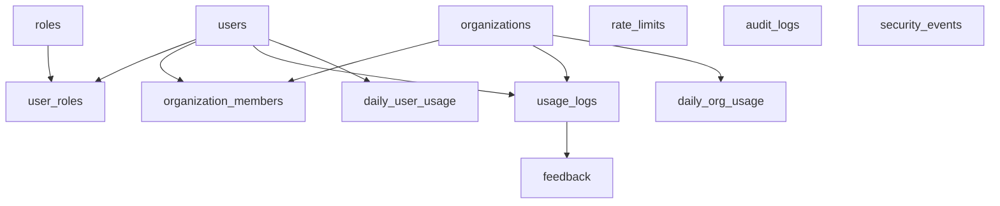
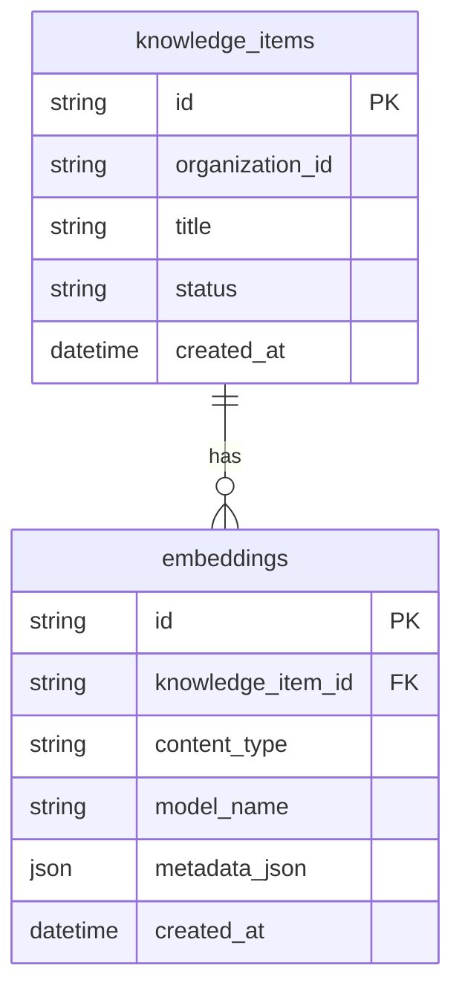

# 05_erd_md

作成日時: 2026年3月1日 17:30
最終更新日時: 2026年3月1日 17:48
最終更新者: iseebi

# 05_erd_md.md

# 🗄️ DB設計書（本プロジェクト適用版：テンプレ準拠）

---

# 0️⃣ 設計観点

| 項目 | 内容 |
| --- | --- |
| 権限モデル | **RBAC（P0）** + 将来ABAC拡張（P2） |
| ID戦略 | **ULID（推奨）**（時系列追跡しやすい）※実装上は文字列で保持 |
| 論理削除 | **無（P0）**（必要ならP1で is_deleted を追加） |
| 監査ログ | **必須（P0）**（管理操作・重要イベントを記録） |
| 個人情報 | 本文は保存しない。必要最小限（Discord user id 等）のみ保持 |
| 分離方針 | **Dify内部DBは別（Supabase）**。本DB（TiDB）はアプリ台帳・観測・権限制御に集中 |
| レート制限 | **トークン/日**（ユーザー単位＋サークル単位） |

---

# 1️⃣ テーブル一覧（Phase付き）

| ドメイン | テーブル名 | 役割 | Phase |
| --- | --- | --- | --- |
| アカウント | users | ユーザー主体（Discord user id） | P0 |
| 認可 | roles | ロール定義（new_student/member/admin） | P0 |
| 認可 | user_roles | ユーザーへのロール付与履歴 | P0 |
| 組織 | organizations | サークル/テナント（現状1サークルでも拡張前提） | P0 |
| 組織 | organization_members | 所属関係（org内ロール等） | P0 |
| コア（台帳） | usage_logs | 1リクエスト=1行の決済台帳（本文なし） | P0 |
| コア（集計） | daily_user_usage | ユーザー日次集計（上限制御/KPI） | P0 |
| コア（集計） | daily_org_usage | サークル日次集計（上限制御/KPI） | P0 |
| 制御 | rate_limits | 上限設定（user/org単位） | P0 |
| フィードバック | feedback | 👍/👎（理由は短文 or 選択式） | P0 |
| 監査 | audit_logs | 管理操作の監査ログ | P0 |
| セキュリティ | security_events | ログイン失敗・レート制限発動など | P0 |
| 補助 | notifications | 通知（Discord通知等をP1で） | P1 |
| 拡張 | policies | ABACポリシー（任意） | P2 |
| 拡張 | policy_logs | ABAC評価ログ（任意） | P2 |
| ベクトル（任意） | embeddings | ベクトル格納（Dify外でRAG/検索を拡張する場合） | P2 |

---

# 2️⃣ ERD（本DB：TiDB）



---

# 3️⃣ カラム定義

## 3-1 users

| カラム | 型 | 制約 | 説明 |
| --- | --- | --- | --- |
| id | VARCHAR | PK | Discord user id（または内部ユーザーID） |
| display_name | VARCHAR |  | 表示名 |
| status | ENUM | NOT NULL | active/inactive |
| created_at | TIMESTAMP | NOT NULL | 作成日時 |
| updated_at | TIMESTAMP | NOT NULL | 更新日時 |

---

## 3-2 roles

| カラム | 型 | 制約 | 説明 |
| --- | --- | --- | --- |
| id | SMALLINT | PK |  |
| name | VARCHAR | UNIQUE NOT NULL | new_student / member / admin |
| level | SMALLINT | NOT NULL | 数値が高いほど強い（RBAC判定用） |

---

## 3-3 user_roles

| カラム | 型 | 制約 | 説明 |
| --- | --- | --- | --- |
| id | VARCHAR | PK | ULID |
| user_id | VARCHAR | FK NOT NULL | users.id |
| role_id | SMALLINT | FK NOT NULL | roles.id |
| granted_at | TIMESTAMP | NOT NULL | 付与日時 |
| granted_by | VARCHAR |  | 付与者（adminのuser_id） |

---

## 3-4 organizations

| カラム | 型 | 制約 | 説明 |
| --- | --- | --- | --- |
| id | VARCHAR | PK | ULID |
| name | VARCHAR | NOT NULL | サークル名 |
| status | ENUM | NOT NULL | active/inactive |
| created_at | TIMESTAMP | NOT NULL | 作成日時 |

---

## 3-5 organization_members

| カラム | 型 | 制約 | 説明 |
| --- | --- | --- | --- |
| id | VARCHAR | PK | ULID |
| organization_id | VARCHAR | FK NOT NULL | organizations.id |
| user_id | VARCHAR | FK NOT NULL | users.id |
| member_role | VARCHAR | NOT NULL | org内ロール（member/admin等） |
| joined_at | TIMESTAMP | NOT NULL | 参加日時 |

---

## 3-6 rate_limits

| カラム | 型 | 制約 | 説明 |
| --- | --- | --- | --- |
| id | VARCHAR | PK | ULID |
| target_type | ENUM | NOT NULL | user / organization |
| target_id | VARCHAR | NOT NULL | users.id または organizations.id |
| daily_token_limit | INT | NOT NULL | 1日上限（トークン） |
| created_at | TIMESTAMP | NOT NULL | 作成日時 |
| created_by | VARCHAR |  | 設定者 |

---

## 3-7 usage_logs（決済台帳：本文なし）

| カラム | 型 | 制約 | 説明 |
| --- | --- | --- | --- |
| id | VARCHAR | PK | ULID |
| trace_id | VARCHAR | INDEX | 分散追跡ID |
| organization_id | VARCHAR | FK NOT NULL | organizations.id |
| user_id | VARCHAR | FK NOT NULL | users.id |
| occurred_at | TIMESTAMP | INDEX NOT NULL | 実行日時 |
| category | VARCHAR |  | 入部/活動/技術など |
| input_tokens | INT | NOT NULL | 入力トークン |
| output_tokens | INT | NOT NULL | 出力トークン |
| total_tokens | INT | NOT NULL | 合計 |
| estimated_cost | DECIMAL | NOT NULL | 推定コスト |
| latency_ms | INT |  | 処理時間 |
| status | ENUM | NOT NULL | success/fail |
| model | VARCHAR |  | gemini-xxx |
| source_count | INT |  | 引用数 |

---

## 3-8 daily_user_usage（上限制御・高速集計）

| カラム | 型 | 制約 | 説明 |
| --- | --- | --- | --- |
| id | VARCHAR | PK | ULID |
| usage_date | DATE | UNIQUE(user_id, usage_date) | JST基準 |
| user_id | VARCHAR | FK NOT NULL | users.id |
| organization_id | VARCHAR | FK NOT NULL | organizations.id |
| total_tokens | INT | NOT NULL | 日次合計 |
| total_cost | DECIMAL | NOT NULL | 日次推定コスト |
| updated_at | TIMESTAMP | NOT NULL | 更新日時 |

---

## 3-9 daily_org_usage（サークル全体上限）

| カラム | 型 | 制約 | 説明 |
| --- | --- | --- | --- |
| id | VARCHAR | PK | ULID |
| usage_date | DATE | UNIQUE(organization_id, usage_date) | JST基準 |
| organization_id | VARCHAR | FK NOT NULL | organizations.id |
| total_tokens | INT | NOT NULL | 日次合計 |
| total_cost | DECIMAL | NOT NULL | 日次推定コスト |
| updated_at | TIMESTAMP | NOT NULL | 更新日時 |

---

## 3-10 feedback（👍/👎）

| カラム | 型 | 制約 | 説明 |
| --- | --- | --- | --- |
| id | VARCHAR | PK | ULID |
| usage_log_id | VARCHAR | FK NOT NULL | usage_logs.id |
| user_id | VARCHAR | FK NOT NULL | users.id |
| organization_id | VARCHAR | FK NOT NULL | organizations.id |
| rating | ENUM | NOT NULL | good/bad |
| reason_code | VARCHAR |  | 選択式理由（例：not_relevant 等） |
| comment_short | VARCHAR |  | 短文（任意、上限あり） |
| created_at | TIMESTAMP | NOT NULL | 作成日時 |

---

## 3-11 audit_logs（監査ログ）

| カラム | 型 | 制約 | 説明 |
| --- | --- | --- | --- |
| id | VARCHAR | PK | ULID |
| occurred_at | TIMESTAMP | INDEX NOT NULL | 発生日時 |
| actor_user_id | VARCHAR |  | 実行者 |
| organization_id | VARCHAR |  | 対象org |
| action | VARCHAR | NOT NULL | admin.rate_limit.update等 |
| resource_type | VARCHAR | NOT NULL | user/rate_limit/knowledge等 |
| resource_id | VARCHAR |  | 対象ID |
| before_json | JSON |  | 変更前 |
| after_json | JSON |  | 変更後 |
| result | ENUM | NOT NULL | allow/deny |
| trace_id | VARCHAR |  | 追跡ID |

---

## 3-12 security_events（セキュリティイベント）

| カラム | 型 | 制約 | 説明 |
| --- | --- | --- | --- |
| id | VARCHAR | PK | ULID |
| occurred_at | TIMESTAMP | INDEX NOT NULL | 発生日時 |
| organization_id | VARCHAR |  | org |
| user_id | VARCHAR |  | user |
| event_type | VARCHAR | NOT NULL | auth.fail/quota.block等 |
| severity | ENUM | NOT NULL | low/medium/high |
| trace_id | VARCHAR |  | 追跡ID |
| metadata_json | JSON |  | 追加情報（本文なし） |

---

# 4️⃣ 権限設計

## 4-1 RBAC（P0）

- `roles.level` を用いた比較で許可判定
- 例：admin >= member >= new_student

判定例（概念） - `required_level <= user_role_level` なら allow

## 4-2 ABAC（任意：P2）

将来的に条件ベース制御が必要になった場合に追加する。

例（概念）

```json
{
  "subject.role": "MEMBER",
  "resource.type": "knowledge",
  "environment.time": "within_open_hours"
}
```

追加テーブル（P2） | テーブル | 役割 | | — | — | | policies
| 条件定義 | | policy_logs | 評価ログ |

---

# 5️⃣ ベクトルDB設計（任意：P2）

本プロジェクトは
**RAG本体はDify側で運用**するため、P0では本DBにベクトルを持たない。

ただし、将来「Dify外でも検索機能を拡張する」「TiDB
Vectorに寄せる」場合のテンプレを定義する。

## 5-1 アーキテクチャ選択

### A. 同一DB内（RDB + Vector）

- TiDB Vectorを採用する場合の想定

### B. 外部ベクトルDB分離

- Difyが管理するVector DBを継続する場合の想定

## 5-2 専用ベクトルテーブル（推奨）



### embeddings（テンプレ）

| カラム | 型 | 説明 |
| --- | --- | --- |
| id | VARCHAR | PK（ULID） |
| knowledge_item_id | VARCHAR | 紐づくリソース |
| content_type | VARCHAR | title/body/comment 等 |
| embedding | VECTOR(N) | ベクトル（TiDB Vector等） |
| metadata_json | JSON | フィルタ用属性 |
| model_name | VARCHAR | 使用モデル |
| created_at | TIMESTAMP | 作成日時 |

### メタデータ例（検索フィルタ）

```json
{
  "organization_id": "club_001",
  "visibility": "public",
  "language": "ja",
  "source": "discord",
  "channel": "newcomers"
}
```

---

# 6️⃣ インデックス設計（推奨）

- usage_logs: (occurred_at), (user_id, occurred_at), (organization_id,
occurred_at), (trace_id)
- daily_user_usage: UNIQUE(user_id, usage_date)
- daily_org_usage: UNIQUE(organization_id, usage_date)
- audit_logs: (occurred_at), (actor_user_id)
- security_events: (occurred_at), (event_type)

※ ベクトルを採用する場合は、採用方式（HNSW等）に合わせて追加

---

# 7️⃣ 更新戦略（台帳・集計）

| 戦略 | 説明 |
| --- | --- |
| 同期更新 | API処理内で usage_logs insert + 日次集計 upsert |
| 非同期更新 | 高負荷時はキュー化して後追い集計（P2以降） |
| 再集計バッチ | 料金体系変更等の際に月次で再集計（任意） |

---

# 8️⃣ SQL集計の例（参考）

## 日次ユーザー消費トークン

```sql
SELECT user_id, SUM(total_tokens) AS tokens
FROM usage_logs
WHERE occurred_at >= :from AND occurred_at < :to
GROUP BY user_id
ORDER BY tokens DESC;
```

## カテゴリ別成功率

```sql
SELECT category,
       SUM(CASE WHEN status='success' THEN 1 ELSE 0 END) / COUNT(*) AS success_rate
FROM usage_logs
WHERE occurred_at >= :from AND occurred_at < :to
GROUP BY category;
```

---