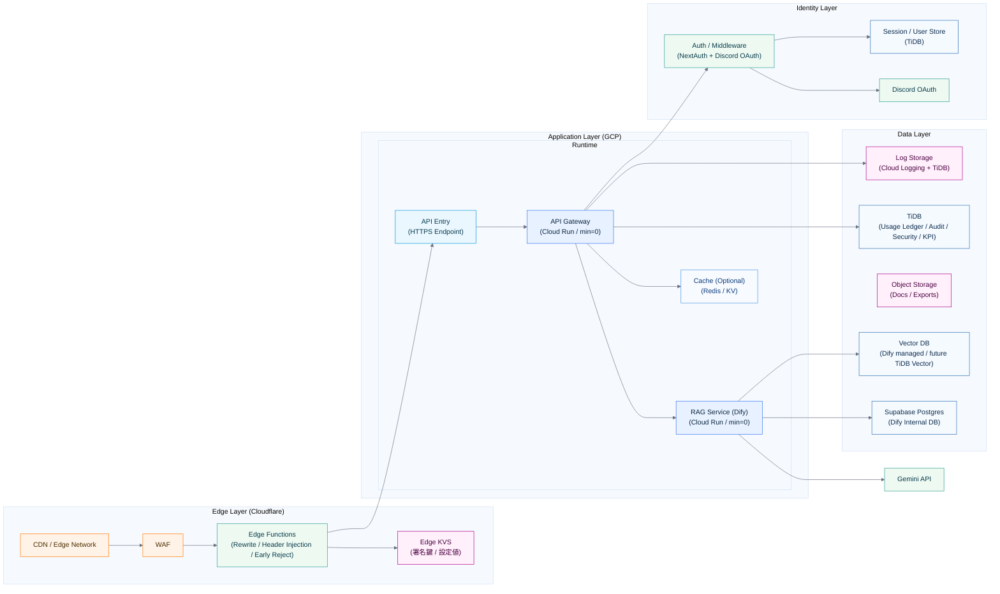

# 07_infrastructure

作成日時: 2026年3月1日 17:21
最終更新日時: 2026年3月1日 17:23
最終更新者: iseebi

# 07_infrastructure.md

# 🏗 Infrastructure Guidelines（本プロジェクト適用版）

---

# 0️⃣ 前提（本プロジェクト）

| 項目 | 内容 |
| --- | --- |
| Frontend | Next.js（Cloudflare） |
| Edge | Cloudflare CDN / WAF / Workers（必要に応じて） |
| Backend | Cloud Run（api-gateway / dify を分離、min instances=0） |
| LLM | Gemini API |
| RDB（台帳） | TiDB（Usage Ledger / Audit / Security / KPI） |
| Dify内部DB | Supabase Postgres（Cloud SQLは使わない） |
| ログ方針 | 本文は保存しない（メタ情報のみ） |
| レート制限 | トークン/日（ユーザー単位＋サークル単位） |
| デプロイ | Docker（本番も利用） + CI/CD |
| 目的 | 低コスト運用、後継運用しやすさ、スケール容易性、セキュアな境界 |

---

# System Architecture

---

# System Components

---

## 1️⃣ Edge Layer（Cloudflare）

### CDN / Edge Network

- 静的アセット配信（Next.js）
- TLS終端
- キャッシュ
- 地理的最適化（レイテンシ最小化）

### WAF

- L7レベルの攻撃対策（DDoS/悪性bot）
- ルールは最小から開始し、誤検知を避けて段階導入

### Edge Functions（Cloudflare Workers / Middleware）

役割：
- リライト（/api 経路の振り分け）
- ヘッダー注入（trace_id / request_id）
- 早期Reject（想定外のオリジンアクセス、明らかな不正）

設計意図：
- 全リクエストにかかる軽処理はEdgeへ
- オリジン負荷を軽減
- 体感レイテンシを改善

### Edge KVS

- 署名鍵（公開鍵やkidメタ）/ ルール設定値を格納（必要時）
- JWT検証をEdgeで行う場合の補助（P1以降）

---

## 2️⃣ Application Layer（Cloud Run）

### API Gateway（Cloud Run / min=0）

責務：
- 認証後のAPI（ユーザー識別）
- **トークン/日レート制限**（ユーザー単位＋サークル単位）
- **利用履歴の完全保存**（本文非保存）
- Dify呼び出し（プロキシ）
- 管理画面向け集計API（KPI/CSV）

推奨設定（初期）：
- CPU：1 vCPU
- メモリ：512MB〜1GB
- Concurrency：50〜80
- Timeout：60s
- Max instances：10（様子見で増減）
- min instances：0（scale-to-zero）

### RAG Service（Dify on Cloud Run / min=0）

責務：
- 検索→生成→引用（RAG）
- ナレッジ管理（データセット）
- ワークフロー（必要に応じて）

推奨設定（初期）：
- CPU：1〜2 vCPU
- メモリ：2GB〜4GB
- Concurrency：10〜30
- Timeout：120s
- Max instances：5
- min instances：0

コールドスタート対策：
- UIに「初回は数秒かかる」表示
- レイテンシ計測（ログ）を必須化して継続観測

### Cache（Optional）

用途：
- レート制限の短期キャッシュ（DB負荷軽減）
- セッション/設定値のキャッシュ（将来）

方針：
- P0は必須ではない（TiDB集計で成立）
- P1以降、負荷が見えたら導入

---

## 3️⃣ Identity Layer（分離推奨）

構成：
- Auth / Middleware：NextAuth + Discord OAuth
- Identity Provider：Discord
- Auth Database：TiDB（ユーザー/ロール/組織、必要な場合のみ）

設計原則：

| 原則 | 理由 |
| --- | --- |
| アプリと分離 | IDP（Discord）切替や拡張の余地 |
| 独立スケール | 認証集中時間帯（入部シーズン）対応 |
| DB直接アクセス禁止 | 責務分離（API経由でのみ操作） |

---

## 4️⃣ Data Layer

| コンポーネント | 用途 |
| --- | --- |
| TiDB（RDB） | Usage Ledger / Audit / Security / KPI（SQL分析） |
| Vector DB | 類似検索（Dify管理、将来TiDB Vectorも検討） |
| Object Storage | ナレッジファイル、エクスポート、バックアップ（必要時） |
| Log Storage | Cloud Logging（短期） + TiDB（台帳/監査） |
| Supabase Postgres | Dify内部DB（設定・実行ログ・ナレッジ台帳） |

---

# 設計意図

---

## 認可処理を高速化するために（Edge活用）

- 可能ならEdgeで早期Reject（明らかな未認証アクセス等）
- trace_idをEdgeで発番/注入して、API〜Difyまで追跡可能にする

※ JWTの完全検証をEdgeでやるかはP1以降で判断（P0はNextAuth/Backendで最終判定）

---

## IdentityとApplicationの分離

- 外部IDP（Discord）を前提にしつつ、アプリの認可/レート制御はAPIで最終判定
- 認証・認可境界を明確にして運用負荷を下げる

---

## Container（Cloud Run）を採用する理由

- 接続管理（DB接続、外部API）を安定させやすい
- デプロイが簡単（Docker）
- スケール0でコスト最適化できる

---

## Vector DBを分離する理由

- 類似検索は負荷特性がRDBと異なる
- 将来スケール（HNSW/Shard）前提で設計しておく
- Difyに寄せてまず動かし、後から最適化できる

---

## Cacheを利用する理由（必要になってから）

- レート制限判定の高速化
- 設定値参照の効率化
- 読み取り最適化

---

# スケーリング戦略

---

## 水平スケール

| レイヤー | 方法 |
| --- | --- |
| Edge | Cloudflareにより自動スケール |
| App | Cloud Runの自動スケール（max instancesで制御） |
| RDB | TiDBのスケール/最適化（運用に合わせて） |
| Vector | インデックス（HNSW等）/ シャーディング（将来） |

---

## 局所アクセス対策（イベント/入部シーズン）

- scale-to-zeroは継続（min=0）
- UXでコールドスタートを吸収（ローディング、非同期UI）
- 必要なら期間限定でmax instances調整（P1以降）

---

# 運用チェックリスト（P0）

- [ ]  Cloudflareでtrace_id（x-request-id）を注入
- [ ]  API Gatewayでレート制限（トークン/日）
- [ ]  本文非保存のテスト（ログ/DB）
- [ ]  Difyの内部DBをSupabaseで安定運用
- [ ]  Cloud Runのmax instances設定
- [ ]  主要KPI（質問数/成功率/平均レイテンシ/推定コスト）をSQLで出せる