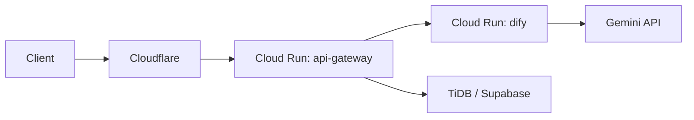
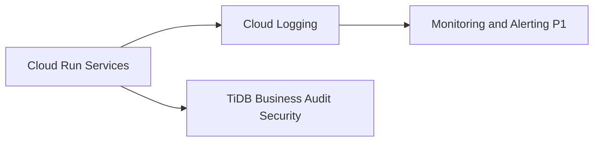
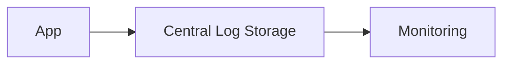

# 08_logging

作成日時: 2026年3月1日 16:21
最終更新日時: 2026年3月1日 16:29
最終更新者: iseebi

# 📘 ログ設計（完成版 v3：テンプレ準拠＋本プロジェクト適用）

---

# 0️⃣ 設計前提

| 項目 | 内容 |
| --- | --- |
| 対象システム | Web（Cloudflare/Next.js） / API（Cloud Run） / RAG（Dify on Cloud Run） /
DB（TiDB, Supabase） |
| ログ方式 | **構造化ログ（JSON）必須** |
| 集約方式 | Phase0: Cloud Run標準ログ + TiDB（台帳） / Phase1: Centralized Logging（GCP
Logging中心） |
| 保持期間 | Application 30日 / Access 90日 / Audit・Security 1年以上 / Business 90日以上 |
| 個人情報 | **本文は保存しない**。PIIは原則収集しない。必要な場合はマスキング/匿名化。 |
| レート制限 | **トークン/日**（ユーザー単位 + サークル単位） |
| 目的 | 障害解析・監査・KPI・コスト管理・不正利用検知 |

---

# 1️⃣ ログ分類

| 種別 | 目的 | 出力対象（誰が見るか） | 保存先 |
| --- | --- | --- | --- |
| Application Log | 動作確認・デバッグ・障害解析 | 開発・運用 | Cloud Run標準ログ |
| Access Log | リクエスト追跡・性能確認 | 運用 | Cloud Run標準ログ |
| Audit Log | 管理操作の監査 | 管理者/監査 | TiDB（AUDIT_LOGS） |
| Security Log | 異常検知（不正利用の兆候） | 運用（P2以降はSOC相当） | TiDB（SECURITY_EVENTS） |
| Business Log | KPI分析・コスト・レート制御根拠 | 管理者/BI | TiDB（USAGE_LOGS +
日次集計） |
| Infrastructure
Log | リソース監視 | SRE相当（P1以降） | Cloud Monitoring（将来） |

---

# 2️⃣ ログレベル定義

| レベル | 用途 | 運用方針 |
| --- | --- | --- |
| DEBUG | 詳細情報 | **本番は原則無効**（必要時のみ一時的に有効化） |
| INFO | 正常動作 | 通常運用の基本 |
| WARN | 想定内の異常 | 監視対象（増加傾向は要調査） |
| ERROR | 処理失敗 | 原則アラート対象（P1以降） |
| FATAL | サービス停止級 | 即時対応（P2以降） |

---

# 3️⃣ 構造化ログフォーマット（JSON標準）

全ログで共通の上位構造を揃える（**messageは本文ではなく、状態説明のみ**）。

```json
{
  "timestamp": "2026-03-01T10:00:00+09:00",
  "level": "INFO",
  "service": "api-gateway",
  "environment": "prod",
  "trace_id": "01H...",
  "user_id": "discord_123",
  "org_id": "club_001",
  "tenant_id": null,
  "action": "chat.request",
  "resource_type": "chat",
  "resource_id": "req_01H...",
  "message": "Request accepted",
  "metadata": {
    "category": "join",
    "status": "allow"
  }
}
```

---

# 4️⃣ 必須フィールド

| フィールド | 理由 | 本プロジェクトでの扱い |
| --- | --- | --- |
| timestamp | 時系列追跡 | 必須 |
| level | 重要度 | 必須 |
| service | マイクロサービス識別 | `frontend` / `api-gateway` / `dify` |
| trace_id | 分散トレーシング | **必須（全サービスで引継ぎ）** |
| user_id | 監査 | Discord user id（未ログイン時はnull） |
| tenant_id | マルチテナント | 現状null（将来拡張用に予約） |
| action | 操作識別 | 例：`quota.block`、`admin.update_limit` |
| org_id | サークル識別 | tenant代替として必須（現状） |

---

# 5️⃣ Application Log設計

## 目的

- デバッグ
- 障害解析（外部API失敗、DB失敗、タイムアウト）

## 出力例（本文なし）

```json
{
  "timestamp": "2026-03-01T12:00:00+09:00",
  "level": "ERROR",
  "service": "api-gateway",
  "environment": "prod",
  "trace_id": "abc-123",
  "user_id": "discord_123",
  "org_id": "club_001",
  "action": "db.insert",
  "message": "Database operation failed",
  "metadata": {
    "error_code": "DB_CONN_TIMEOUT",
    "retryable": true
  }
}
```

## ルール

- 入力テキスト（質問本文）はログに出さない
- stacktraceはCloud
Run側に出る場合もあるので、例外メッセージに本文が混ざらないよう注意

---

# 6️⃣ Access Log設計

## 目的

- APIの利用状況把握（パス・ステータス・レイテンシ）
- コールドスタート等の影響の見える化

```json
{
  "timestamp": "2026-03-01T12:00:00+09:00",
  "level": "INFO",
  "service": "api-gateway",
  "trace_id": "01H...",
  "action": "http.access",
  "metadata": {
    "method": "POST",
    "path": "/api/chat",
    "status": 200,
    "latency_ms": 120
  }
}
```

## IP / User-Agentについて

- 原則保存しない（PII最小化）
- どうしても必要になった場合のみ、以下いずれかで対応（P2以降）
    - IPの/24マスク、またはハッシュ化
    - UAは主要部分のみ抽出（例：ブラウザ種別）

---

# 7️⃣ Audit Log設計（重要）

## 対象操作（P0最小→P1完全）

### P0（最小）

- レート上限変更（もし実装するなら）
- ユーザーブロック/解除（もし実装するなら）
- ナレッジ削除（もし実装するなら）

### P1（完全）

- ロール変更
- 設定変更（Difyキー、上限、カテゴリ定義、保持期間等）
- データ削除（ナレッジ、ユーザー、ログのアーカイブ）
- 認証失敗（管理画面ログイン失敗）

```json
{
  "timestamp": "2026-03-01T12:00:00+09:00",
  "level": "INFO",
  "service": "api-gateway",
  "trace_id": "01H...",
  "user_id": "discord_admin",
  "org_id": "club_001",
  "action": "rate_limit.update",
  "resource_type": "rate_limit",
  "resource_id": "org:club_001",
  "message": "Rate limit updated",
  "metadata": {
    "before": {"daily_token_limit": 20000},
    "after": {"daily_token_limit": 15000},
    "result": "allow"
  }
}
```

保存先：TiDB（AUDIT_LOGS）

保持：1年以上

---

# 8️⃣ セキュリティログ

| イベント | 記録 | 本プロジェクトの理由 |
| --- | --- | --- |
| ログイン失敗 | 必須 | 不正アクセス兆候 |
| 異常アクセス | 必須 | ボット・連投 |
| レート制限発動 | 必須 | コスト爆発防止の根拠 |
| ABAC deny | 推奨（P2以降） | ABAC採用時に有効 |
| 異常トークン消費 | 必須 | 1人の暴走検知 |
| Dify API失敗の連発 | 推奨 | 障害/攻撃の早期検知 |

例（quota.block / security）

```json
{
  "timestamp": "2026-03-01T12:00:00+09:00",
  "level": "WARN",
  "service": "api-gateway",
  "trace_id": "01H...",
  "user_id": "discord_123",
  "org_id": "club_001",
  "action": "quota.block",
  "message": "Daily token quota exceeded",
  "metadata": {
    "scope": "user",
    "daily_used_tokens": 10050,
    "daily_limit_tokens": 10000
  }
}
```

保存先：TiDB（SECURITY_EVENTS）

保持：1年以上

---

# 9️⃣ 分散トレーシング設計



## trace_id必須ルール

- 全サービスで引き継ぐ
- HTTP Headerで伝播する
- すべてのログに同一trace_idを含める

## 推奨ヘッダ

- Cloudflare → API：`CF-Ray`（参照用）＋ アプリ独自 `x-request-id`
- API内部：`x-request-id` を **trace_id** として採用
- API → Dify：`x-request-id` をそのまま転送（例：`X-Request-Id`）

---

# 🔟 ログ保存構成（段階導入）

P0では運用コストを抑えるため、LogAgent等は置かない。



将来（P2+）の中央集約を強化する場合：



---

# 1⃣1️⃣ 保持ポリシー

| 種類 | 保持期間 | 保存先 | 備考 |
| --- | --- | --- | --- |
| Application | 30日 | Cloud Logging | 障害解析 |
| Access | 90日 | Cloud Logging | 性能/リクエスト |
| Audit | 1年以上 | TiDB | 管理操作監査 |
| Security | 1年以上 | TiDB | 不正利用検知 |
| Business | 90日以上 | TiDB | KPI/コスト/上限制御根拠 |

---

# 1⃣2️⃣ マスキングポリシー

| 対象 | 方針 |
| --- | --- |
| パスワード | 絶対出力禁止 |
| トークン/APIキー | 絶対出力禁止。必要なら末尾4桁のみ |
| メール | 原則保持しない。必要ならハッシュ化 |
| IP | 原則保持しない。必要なら匿名化（/24, ハッシュ等） |
| メッセージ本文 | **絶対保存しない**（ログにもDBにも出さない） |
| 添付/URL | 原則保存しない。必要ならドメインのみ等に加工 |

---

# 1⃣3️⃣ フェーズ導入

```
Phase0:
- Application Log（Cloud Run）
- Access Log（Cloud Run）
- Business Log（TiDB台帳）
- 最低限のAudit/Security（上限・ブロック・ログイン失敗）

Phase1:
- 構造化ログの完全統一（全サービス）
- Centralized Logging（Cloud Logging上での検索・ダッシュボード）
- Sentry導入（フロント/バック）
- Discord通知（エラー/上限80%など）

Phase2:
- 分散トレーシング強化（OpenTelemetry導入検討）
- セキュリティイベント自動検知（連投、急増、異常レイテンシ）

Phase3:
- SIEM連携
- 異常検知AI（運用規模が必要）
```

---

# 1⃣4️⃣ コスト最適化

| 方法 | 説明 |
| --- | --- |
| DEBUG無効 | 本番ログ量削減（必要時のみ一時有効） |
| サンプリング | Access Logを高トラフィック時にサンプリング（P2） |
| ローテーション/アーカイブ | TiDB台帳の古い月を圧縮/別テーブルへ |
| メタ情報の最小化 | PII削減で保存コストも削減 |
| エラー分類（error_code） | 同じ障害の集約が容易になり調査コスト減 |

---

# 付録：推奨アクション命名（例）

- `auth.login.success` / `auth.login.fail`
- `chat.request` / `chat.response`
- `rag.call` / `rag.error`
- `quota.check` / `quota.block`
- `feedback.submit.good` / `feedback.submit.bad`
- `admin.rate_limit.update`
- `admin.user.block` / `admin.user.unblock`
- `knowledge.upsert` / `knowledge.delete`